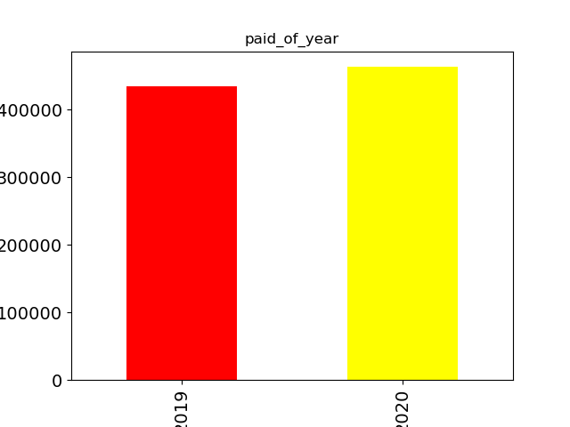
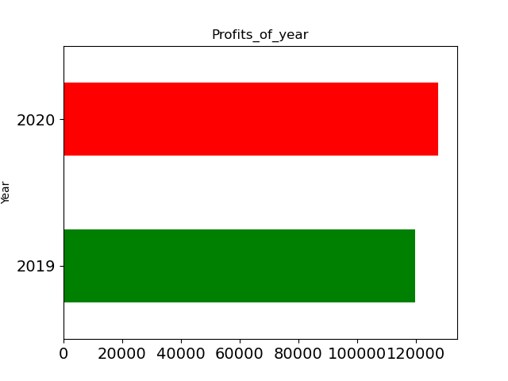
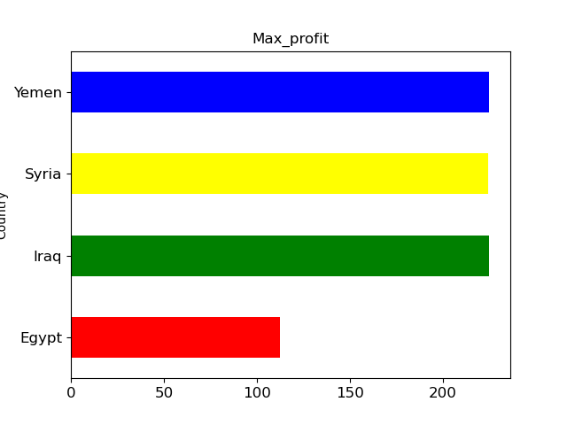
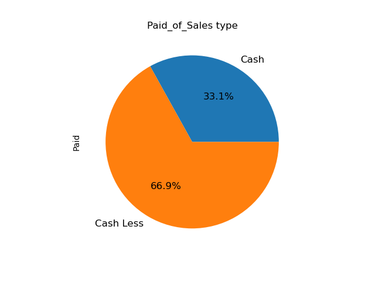

# 🤖 Automated Data Pipeline & Profit Predictor

A robust **Data Engineering** project built with Python to automate the ETL process, visualize business insights, and predict future profits.

## 🚀 Features
* **Automation (Robot Mode):** Continuously monitors an `Input` folder for new data files.
* **ETL Pipeline:** Automatically extracts data from CSV/Excel, cleans timestamps, and generates executive summaries.
* **Data Visualization:** Generates charts for profit by year, country, and sales type.
# 📊 Data Insights & Visualizations
Here are some of the automated insights generated by the system:

# 💰 Profits & Payments Analysis
 Yearly Paid | Yearly Profits |

|  |  |

# 🌍 Geographical Analysis

# 📈 Sales Performance

* **Machine Learning:** Predicts future profits based on price using Linear Regression.

## 🛠️ Tech Stack
* **Language:** Python
* **Libraries:** Pandas, Matplotlib, Scikit-learn, Tkinter.
* **Database Integration Ready:** Designed for SQL Server export.

## 📁 Project Structure
- `main.py`: The GUI and analysis engine.
- `functions.py`: Core logic for file handling and automation.
- `Input/`: Place your raw data here.
- `Outpot/`: Final cleaned reports.